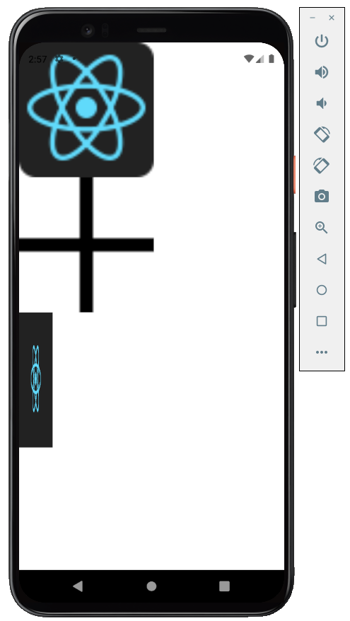

## Testando Imagem no React Native

Aplicativo de visualização básica de imagens



<hr>

Procedimentos para utilizar o aplicativo:

```

npm install
npm start
Aperta a letra 'a' para abrir no dispositivo virtual configurado 

```
<hr>

